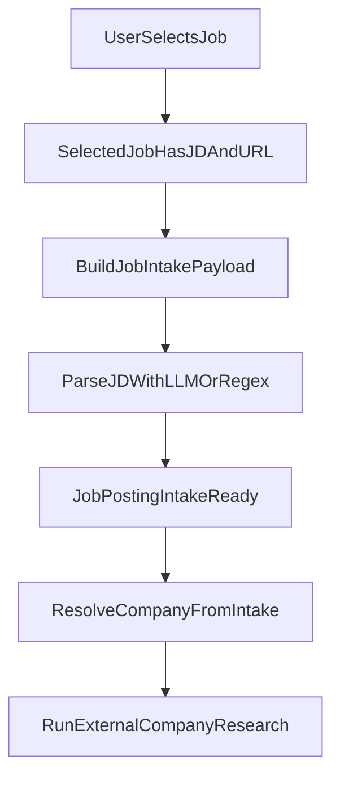

# JD-First Company Research Plan

## Goal

Ensure company research is driven by the already extracted JD content (from selected job payload), with LLM-based parsing to derive company/role metadata before any additional external research queries.

## Findings to Address

- Current selected-job flow stores raw JD text in `[/Users/rodrigosandon/Projects/desktop-agent-agi/app.py](/Users/rodrigosandon/Projects/desktop-agent-agi/app.py)` via `_build_job_intake_payload()` (`answer` is raw JD).
- Intake parsing in `[/Users/rodrigosandon/Projects/desktop-agent-agi/company_research_agent.py](/Users/rodrigosandon/Projects/desktop-agent-agi/company_research_agent.py)` (`JobPostingIntake.from_selected_jd_payload`) is regex-based for Linkup-style text and often fails on raw JD.
- Selected job URL is fetched again in `[/Users/rodrigosandon/Projects/desktop-agent-agi/linkup_client.py](/Users/rodrigosandon/Projects/desktop-agent-agi/linkup_client.py)` (`extract_job_description_from_url`) even when `existing_jd_text` is available.

## Implementation Steps

- Add an LLM JD parser path in `[/Users/rodrigosandon/Projects/desktop-agent-agi/company_research_agent.py](/Users/rodrigosandon/Projects/desktop-agent-agi/company_research_agent.py)`:
  - Create a helper (e.g. `_parse_jd_with_llm`) that takes raw JD text and returns structured fields needed by `JobPostingIntake` (company_name, role_title, location, workplace_type, employment_type, compensation_summary, requirements_summary, preferred_summary).
  - Keep existing regex extraction as fallback for already-structured Linkup-style text.
- Update `JobPostingIntake.from_selected_jd_payload` in `[/Users/rodrigosandon/Projects/desktop-agent-agi/company_research_agent.py](/Users/rodrigosandon/Projects/desktop-agent-agi/company_research_agent.py)`:
  - Detect whether `answer` is raw JD vs Linkup summary format.
  - Use LLM parser for raw JD path; preserve current lightweight parsing path where regex clearly matches.
  - Ensure resulting intake always carries best-effort `company_name` and `role_title`.
- Prevent unnecessary refetch in `[/Users/rodrigosandon/Projects/desktop-agent-agi/linkup_client.py](/Users/rodrigosandon/Projects/desktop-agent-agi/linkup_client.py)`:
  - In `extract_job_description_from_url`, short-circuit and return success when `existing_jd_text` is sufficiently present.
  - Keep fetch fallback for cases where existing text is missing/too short.
- Keep company research sequencing in `[/Users/rodrigosandon/Projects/desktop-agent-agi/app.py](/Users/rodrigosandon/Projects/desktop-agent-agi/app.py)`:
  - Confirm `execute_company_profiler` always builds/uses intake from `job_intake_payload` first.
  - Use parsed `intake.company_name` as preferred source when available, then fallback to `selected_job.company`.
  - Ensure external research queries only run after intake parsing succeeds.
- Validation and safety checks:
  - Add/adjust logs to show whether intake came from `regex` or `llm` parse path.
  - Run lint/quick validation on touched files and manually verify this scenario: select job -> JD extracted once -> company profiler uses parsed intake without re-scraping same job URL.

## Key Data Flow (target)

## Expected Outcome

- Company name and related context come from LLM parsing of the already extracted JD text.
- Duplicate job URL fetches are minimized when JD text already exists.
- Company research becomes deterministic and starts from intake parsing, then performs optional deeper external research.

