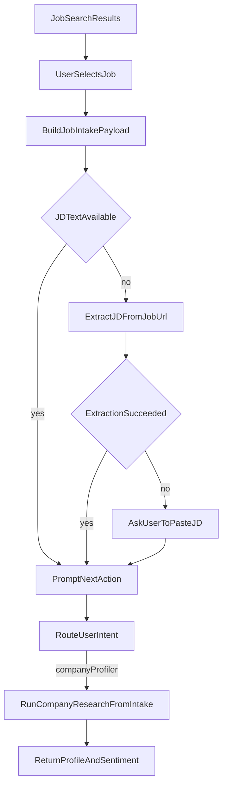

# Implement Selected Job -> Company Profiler Flow

## Goal

After job search results are shown, let the user select one job, automatically build a better JD intake from that job link, ask what they want to do next, and run the company profiler path to return both company profile and company sentiment.

## Scope (phase 1)

- Implement only the `company_profiler` action end-to-end.
- Keep architecture ready for later multi-agent combinations (`resume_tailor`, `cover_letter_generator`, `email_crafter`).

## Current Baseline (already present)

- Job list display + numeric selection already exists in `[/Users/rodrigosandon/Projects/desktop-agent-agi/app.py](/Users/rodrigosandon/Projects/desktop-agent-agi/app.py)`.
- Follow-up prompt (“What do you want to do next?”) already exists in `[/Users/rodrigosandon/Projects/desktop-agent-agi/app.py](/Users/rodrigosandon/Projects/desktop-agent-agi/app.py)`.
- Company research logic exists in `[/Users/rodrigosandon/Projects/desktop-agent-agi/company_research_agent.py](/Users/rodrigosandon/Projects/desktop-agent-agi/company_research_agent.py)`.
- LinkUp adapter methods for company research exist in `[/Users/rodrigosandon/Projects/desktop-agent-agi/linkup_client.py](/Users/rodrigosandon/Projects/desktop-agent-agi/linkup_client.py)`.

## Planned Changes

### 1) Normalize selected-job intake payload with source URL

- File: `[/Users/rodrigosandon/Projects/desktop-agent-agi/app.py](/Users/rodrigosandon/Projects/desktop-agent-agi/app.py)`
- When `selected_job` is set, build `job_intake_payload` with:
  - `answer`: JD text (existing)
  - `sources`: include selected job URL as source metadata (new)
- This enables downstream intake parsing to recover `job_url` and improve contextual research prompts.

### 2) Add JD extraction step from selected job link (fallback-safe)

- Files:
  - `[/Users/rodrigosandon/Projects/desktop-agent-agi/linkup_client.py](/Users/rodrigosandon/Projects/desktop-agent-agi/linkup_client.py)`
  - `[/Users/rodrigosandon/Projects/desktop-agent-agi/app.py](/Users/rodrigosandon/Projects/desktop-agent-agi/app.py)`
- Add/extend a helper that attempts to extract richer JD text from the selected job URL (using existing LinkUp client capabilities).
- Execution order after selection:
  1. If `selected_job.jd_text` is strong/non-empty, use it.
  2. Else try extraction from `selected_job.url`.
  3. If still missing, ask user to paste JD (existing fallback).
- Keep robust error handling so failure to extract does not break the flow.

### 3) Keep the chatbot action prompt, but harden action routing

- File: `[/Users/rodrigosandon/Projects/desktop-agent-agi/app.py](/Users/rodrigosandon/Projects/desktop-agent-agi/app.py)`
- Preserve the post-selection prompt and deterministic routing.
- For phase 1, map user intents like “research the company” directly to `company_profiler`.
- For other intents, keep current placeholders/routes but clearly indicate those are next-phase integrations.

### 4) Route company profiling through JD-aware path

- Files:
  - `[/Users/rodrigosandon/Projects/desktop-agent-agi/app.py](/Users/rodrigosandon/Projects/desktop-agent-agi/app.py)`
  - `[/Users/rodrigosandon/Projects/desktop-agent-agi/linkup_client.py](/Users/rodrigosandon/Projects/desktop-agent-agi/linkup_client.py)`
- Update `execute_company_profiler` to prefer JD-aware company research (`research_from_selected_jd`) when `job_intake_payload` exists.
- Ensure resulting output includes both:
  - company profile report
  - company sentiment report
- Keep fallback to direct `company` + `context` research when intake is unavailable.

### 5) Response formatting + context persistence

- File: `[/Users/rodrigosandon/Projects/desktop-agent-agi/app.py](/Users/rodrigosandon/Projects/desktop-agent-agi/app.py)`
- Return a clean CLI response combining profile and sentiment sections.
- Persist structured result in context/artifacts so later agents can reuse it.

### 6) Validation

- Verify these CLI scenarios manually:
  - search -> select job -> choose “research company” -> receives profile + sentiment
  - selection where JD is missing -> extraction attempt -> fallback paste prompt
  - extraction failure does not crash; still reaches user prompt/fallback
- Add or update focused tests if test harness exists for tool execution and router behavior.

## Data Flow (phase 1)

## Out of Scope for this phase

- Multi-agent combinations (2/3/4 concurrent or chained agents).
- Automatic recruiter messaging execution.
- Resume/cover letter final quality tuning.

